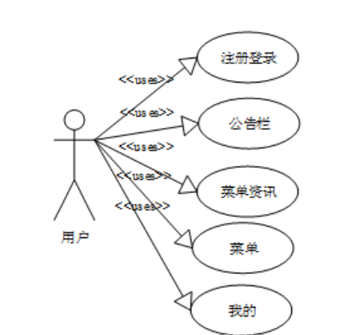
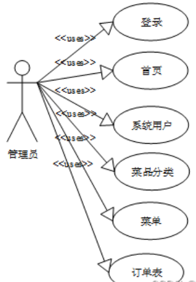
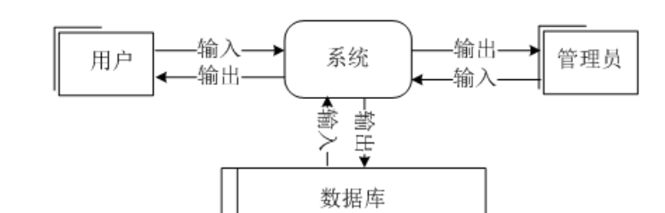
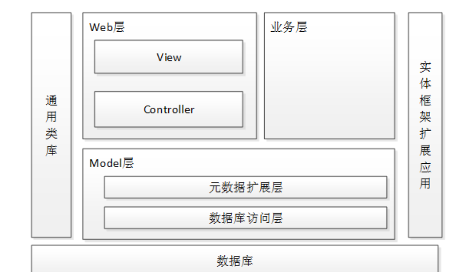
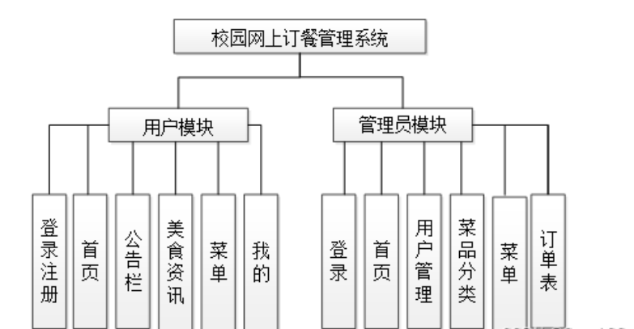
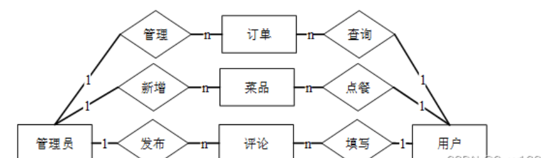
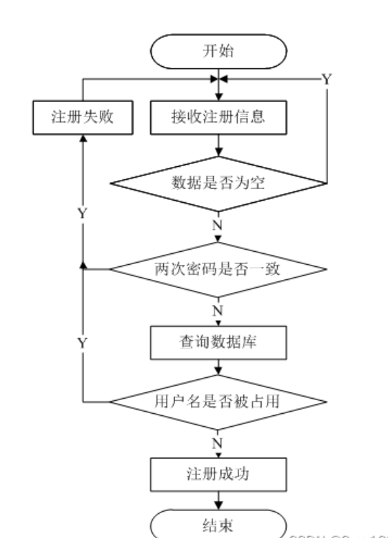
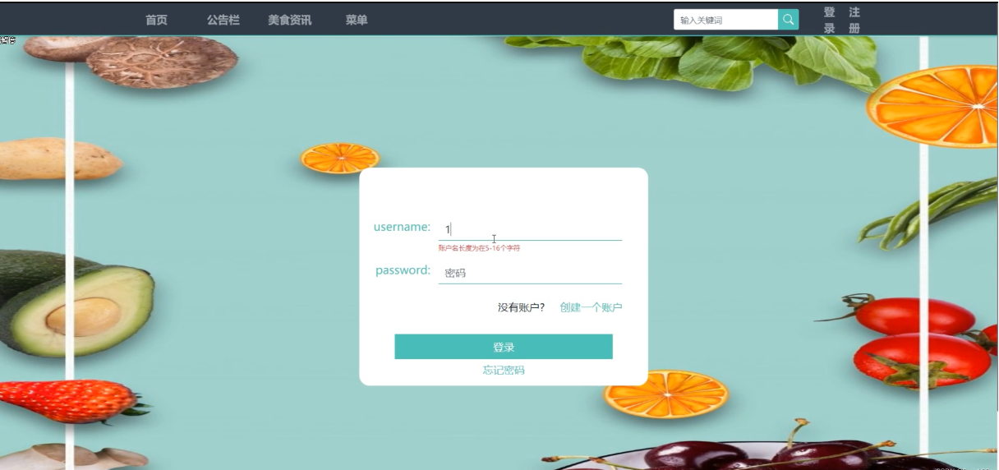

**校园网上订餐系统的设计与实现**

# springBoot Vue

#### 2025 计算机 毕设 项目

#### 扫码领取源码

**摘** **要**

信息化社会内需要与之针对性的信息获取途径，但是途径的扩展基本上为人们所努力的方向，由于站在的角度存在偏差，人们经常能够获得不同类型信息，这也是技术最为难以攻克的课题。针对校园网上订餐系统等问题，对校园网上订餐系统进行研究分析，然后开发设计出校园网上订餐系统系统以解决问题。

校园网上订餐系统系统主要功能模块包括公告内容（公告栏、轮播图）用户管理（管理员、普通用户）、内容模块（资讯分类、资讯列表）、模块管理（菜品分类、菜单、订单表），采取面对对象的开发模式进行软件的开发和硬体的架设，能很好的满足实际使用的需求，完善了对应的软体架设以及程序编码的工作，采取MySQL作为后台数据的主要存储单元，采用SSM框架、Java技术、Ajax技术进行业务系统的编码及其开发，实现了本系统的全部功能。本次报告，首先分析了研究的背景、作用、意义，为研究工作的合理性打下了基础。针对校园网上订餐系统系统的各项需求以及技术问题进行分析，证明了系统的必要性和技术可行性，然后对设计系统需要使用的技术软件以及设计思想做了基本的介绍，最后来实现校园网上订餐系统系统和部署运行使用它。

关键词：校园网上订餐系统；SSM框架；MySQL数据库

**Design and implementation of campus online ordering system**

**Abstract**

In the information society, there is a need for targeted information access, but the expansion of access is basically the direction of people's efforts. Due to the deviation of the perspective, people can often obtain different types of information, which is also the most difficult subject for technology to overcome. Aiming at the problems of campus online ordering system, this paper studies and analyzes the campus online ordering system, and then develops and designs the campus online ordering system to solve the problems.

The main functional modules of the campus online ordering system include announcement content (bulletin board, rotation chart), user management (administrator, ordinary users), content module (information classification, information list), module management (dish classification, menu, order table), and object-oriented development mode for software development and hardware erection, It can well meet the needs of practical use, improve the corresponding software erection and program coding, take MySQL as the main storage unit of background data, use SSM framework, Java technology and Ajax technology to code and develop the business system, and realize all the functions of the system. This report first analyzes the background, function and significance of the research, which lays a foundation for the rationality of the research work. This paper analyzes the various requirements and technical problems of the campus online ordering system, proves the necessity and technical feasibility of the system, and then makes a basic introduction to the technical software and design idea required by the design system. Finally, it realizes the campus online ordering system and deploys and runs it.

****Key words****: Campus online ordering system; SSM framework; Mysql database

1.  **相关技术介绍**
    1.  **HTTP协议**

超文本传输协议（HTTP）作为协作式与分布式的通信协议，其以万维网交换信息作为前提条件。HTTP为IEIF的国际化标准指标，在制定相关标准与实现内，W3C积极参与其中，同时发挥着不可替代的作用。其能够借助超文本标记语言，将文档在服务器与浏览器之间相互传输。HTML作为构架文档的标记语言，这些文档内将包括有关信息的链接，用户仅需要点击其中一个链接就能够访问多媒体对象与图像，同时获得该链接项所具有的附加信息。

1.  1.  **Java语言与JDK开发环境** 

Java是美国sun公司所推出的一款程序设计语言，其能够在多个平台内应用，具有良好兼容性，进而其凭借自身优势在数据中心、个人PC与科技超级计算机等平台内广泛应用，具有目前最为庞大的开发者专业社群。

JDK为美国sun公司为java开发员所推出的一款全新产品，要是没有JDK的情况下，所安装的java程序也就无法运行。

1.  1.  **SSM****框架**

SSM（Spring+SpringMVC+MyBatis）框架集由Spring、MyBatis两个开源框架整合而成（SpringMVC是Spring中的部分内容）。常作为数据源较简单的web项目的框架。

1.6.1 Spring

Spring就像是整个项目中装配bean的大工厂，在配置文件中可以指定使用特定的参数去调用实体类的构造方法来实例化对象。也可以称之为项目中的粘合剂。

Spring的核心思想是IoC（控制反转），即不再需要程序员去显式地\`new\`一个对象，而是让Spring框架帮你来完成这一切。

1.6.2 SpringMVC

SpringMVC在项目中拦截用户请求，它的核心Servlet即DispatcherServlet承担中介或是前台这样的职责，将用户请求通过HandlerMapping去匹配Controller，Controller就是具体对应请求所执行的操作。SpringMVC相当于SSH框架中struts。

1.6.3 mybatis

mybatis是对jdbc的封装，它让数据库底层操作变的透明。mybatis的操作都是围绕一个sqlSessionFactory实例展开的。mybatis通过配置文件关联到各实体类的Mapper文件，Mapper文件中配置了每个类对数据库所需进行的sql语句映射。在每次与数据库交互时，通过sqlSessionFactory拿到一个sqlSession，再执行sql命令。

页面发送请求给控制器，控制器调用业务层处理逻辑，逻辑层向持久层发送请求，持久层与数据库交互，后将结果返回给业务层，业务层将处理逻辑发送给控制器，控制器再调用视图展现数据。

1.  1.  **JSP脚本语言**

JSP可以放在在html里使用，也可以独自使用，它同时也具备有很多种优点，可以讲，Web脚本技术的先驱是JSP。现代编程语言（像C，Java和Perl等）的一些最好的特点都融合在JSP里，Web服务器里的一些配置标准是由JSP、Tomcat和数据库等的组合在一起的。

1.  1.  **MySQL数据库**

MySQL经过多次的更新，功能层面已经非常的丰富和完善了，从MySQL4版本到5版本进行了比较大的更新，在商业的实际使用中取得了很好的实际应用效果。最新版本的MySQL支持对信息的压缩，同时还能进行加密能更好的满足对信息安全性的需求。同时经过系统的多次更新，数据库自身的镜像功能也得到了很大的增强，运行的流畅度和易用性方面有了不小的进步，驱动的使用和创建也更加的高效快捷。最大的变动还是进行了空间信息的显示优化，能更加方便的在应用地图上进行坐标的标注和运算。强大的备份功能也保证了用户使用的过程会更加安心，同时支持的Office特性还支持用户的自行安装和使用。在信息的显示形式上也进行了不小的更新，增加了两个非常使用的显示区，一个是信息区，对表格和文字进行了分类处理，界面的显示更加清爽和具体。第二是仪表的信息控件，能在仪表信息区进行信息的显示，同时还能进行多个信息的比对，为用户的实际使用带来了很大的便捷。

针对本文中设计的校园网上订餐系统系统在实际的实现过程中，最终选择MySQL数据库的主要原因在于在企业的应用系统应用及开发的过程中会存在大量的数据库比较频繁的操作，而且数据的安全性要求也是非常的高。综合这些因素，最终选择安全性系数比较高的MySQL来对校园网上订餐系统系统后台数据进行存储操作。

1.  1.  **企业级架构**

Vue.js是一套构建用户界面的渐进式框架。与其他重量级框架不同的是，Vue采用自底向上增量开发的设计。Vue 的核心库只关注视图层，并且非常容易学习，非常容易与其它库或已有项目整合。另一方面，Vue 完全有能力驱动采用单文件组件和Vue生态系统支持的库开发的复杂单页应用。

Vue.js 的目标是通过尽可能简单的 API 实现响应的[数据绑定](https://baike.baidu.com/item/%E6%95%B0%E6%8D%AE%E7%BB%91%E5%AE%9A/2884939 "数据绑定")和组合的视图组件。

Vue.js 自身不是一个全能框架——它只聚焦于视图层。因此它非常容易学习，非常容易与其它库或已有项目整合。另一方面，在与相关工具和支持库一起使用时，Vue.js 也能驱动复杂的单页应用。

1.  **系统分析**
    1.  **可行性分析**

技术性方面，采用当前主流的SSM框架进行系统主体框架的搭建，前台使用jquery，ajax，实现前台页面的设计与美观调整，以上技术，均由本人经过系统学习，并且都是在课程设计中实践过的，可以使得开发更加便捷和系统。从技术角度看，这个系统是完全可以实现的。

实用性方面，本次设计的主要任务是在校园网上订餐系统系统内菜品分类、菜单、订单表等，符合当前潮流的发展。从用户角度出发，同时也考虑系统运营成本和人力资源，采用网络上的便捷方式，实现线上业务，使得业务流程更系统，也更方便用户的体验，比较实用。

经济性方面，由于本课题中设计的校园网上订餐系统系统的主要目的是为了能够更加方便及快捷的进行信息的查询管理及检索服务，也就是能够可以直接投入使用的信息化软件。系统的主要成本主要是集中在对使用数据后期继续维护及其管理更新这个操作上。但是一旦系统投入到实际的运行及使用之后就能够很好的提高信息查询检索的效率，同时也需要有效的保证查询者的信息方面的安全性，同时这个校园网上订餐系统系统所带来的实际应用方面的价值是远远的超过了实际系统进行开发与维护方面的成本，因此，从经济上来说开发这个软件是可行的。

1.  1.  **功能需求分析**

校园网上订餐系统系统的功能主要分为前台用户根据自己的需求进行注册登录，浏览菜品信息并对选中的菜品进行点餐操作。后台系统管理员因职责的不同，分为普通管理员和超级管理员，管理员主要对注册用户，首页、公告栏、美食资讯、菜单，进行处理。

用户用例图如下所示。

      图3-1 用户用例图

管理员用例图如下所示。

       图3-2 管理员用例图

1.  1.  1.  **前台用户功能**

前台用户可分为未注册用户需求和已注册用户需求。

未注册用户的功能如下：

注册账号：用户填写个人信息，并验证手机号码。

公告栏：用户可以浏览主页面的公告栏信息来了解系统的最新资讯数据。

美食资讯：用户可以根据美食类型浏览美食的信息，并选中某个美食查看详情。

已注册用户的功能如下：

登录：根据账号密码进行登录操作。

维护个人信息：用户因个人信息的变更可以随时修改自己注册信息。

浏览评论信息：选中某间菜品可查看其用户的评论。

菜单：用户可以查看自己以往点餐菜单的信息。

评论：用户可以根据自己的观点看法对相关菜品进行评论。

在线支付：用户根据自己的需求选中某个菜品进行点餐在线支付操作。

1.  1.  1.  **后台管理员功能**

管理员功能如下：

修改密码：管理员可以随时修改自己进入系统的登录密码，以保证系统的安全性。

订单表管理：对菜品信息进行维护，添加、删除、修改信息。

菜品分类列表管理：对菜品分类信息进行维护，添加、删除、修改信息。

菜单管理：对菜单信息进行维护，添加、删除、修改信息。

1.  1.  **非功能需求分析**

首先主要考虑的是系统功能软件，在具体设计的环节上，是不是能够较好的满足各类用户的基本功能需求，如果不能较好的满足用户需求，那么这个系统的存在是没有价值的。软件系统的非功能性求分析，从7个方面展开，一个是性能分析，针对系统；一个是安全分析，针对系统，一个是完整度分析，针对系统，一个是可维护分析，针对系统，一个是可扩展性分析，针对系统，一个是适应业务的性能分析。面对校园网上订餐系统系统存在的性能、安全、扩展、完整度等7个方面性能综合比对分析后发现，需要相应的非功能性需求分析。

1.  1.  **安全性需求分析**
        1.  **系统的安全性**

安全性对每一个系统来说都是非常重要的。安全性很好的系统可以保护企业的信息和用户的信息不被窃取。提高系统的安全性不仅是对用户的负责，更是对企业的负责。尤其针对于校园网上订餐系统系统来说，必须要有很好的安全性来保障整个系统。

系统具有对使用者有权限控制，针对角色的不通限制使用者的权限，以此来确保系统的安全性。

1.  1.  1.  **数据的安全性**

数据库中的数据是从外界输入的，当数据的输入时，由于种种原因，输入的数据会无效，或者是脏数据。因此，怎样保证输入的数据符合规定，成为了数据库系统，尤其是多用户的关系数据库系统首要关注的问题。

因此，在写入数据库时，要保证数据完整性、正确性和一致性。

1.  1.  **数据流程分析**

对系统的数据流进行分析，系统的使用者分为二类，一般用户，管理员。系统主要对界面信息传送，登录信息的验证，注册信息的接收，用户各种操作的响应做处理。

系统顶层数据流图如下图所示。

图3-2 顶层数据流图

要判断用户是是什么身份，是根据登录的数据来判断后，跳转到对应的功能界面。在系统的内部用户就可以对数据进行操作，数据库中心就可以接收到系统传输的有效数据流来对数据sql语句进行对应操作。

系统底层数据流图如下图所示。

图3-3 底层数据流图

系统可以分为前台和后台两部分，每一种操作后系统都返回操作结果。前台和后台的数据连接主要通过数据库，既分别对数据库做不同的操作。

1.  **系统设计**
    1.  **系统架构设计**

本校园网上订餐系统系统的架构设计主要分为可以3层，主要有Web层，业务层，Model层。其中web层还包括View层和Controller层，Model层包括元数据扩展层和数据访问层。

系统架构如下图所示。

图4-1 系统架构

1.  1.  **系统总体设计**

校园网上订餐系统系统总体分为前台用户模块和后台管理员模块。

两个模块表现上是分别独立存在，但是访问的数据库是一样的。每一个模块的功能都是根据先前完成的需求分析，并查阅相关资料后整理制作的。

综上所述，系统功能结构图如下图所示。

图4-2 系统功能结构图

1.  1.  **系统功能设计**

登录模块：登录模块是进入系统的入口，所有用户必须登录后才能访问系统。登录需要输入用户名和密码，如果多次尝试登录需要输入验证码。登录时需要选择用户的角色，是一般用户还是管理员登录等。登录成功后，会通过数据库获取用户的权限，并跳转至用户的主页面。

美食资讯数据模块：可分为资讯数据浏览、资讯数据检索、资讯数据维护三个模块，管理员对资讯数据有维护的权限，发布新的资讯数据、更新已有的资讯数据等。

菜品管理模块：系统菜品的详细分类，具体可见菜品名称、规格、类型、价格等用户可以点击搜索，查询。

订单列表管理模块：订单列表管理分为订单添加、修改和就餐。订单信息由管理员进行修改、添加、删除操作；就餐由普通用户来执行。

1.  1.  **数据库设计**
        1.  **数据需求分析**

从前面可以分析到数据库中最重要的是商城，普通用户，商品分类同时存在订单信息和收货地址。分析可以得到如下数据描述：

普通用户：用于记录用户的各种信息，包括用户名、姓名、性别等数据项。

管理员：记录管理员的登录信息。包括用户名，密码，权限等数据项。

订单表信息：存储用户的订单表信息。包括订单的名称、类型、规格、价格、总计、购买人、联系电话、送餐地址、订单状态、审核状态、支付状态、支付类型等数据项。

菜品分类。存储用户的菜品分类信息。包括类型、审核状态等数据项。

1.  1.  1.  数据库概念设计

根据前面的数据流程图，结合系统的功能模块设计，设计出符合系统的各信息实体。

系统ER图如下图所示。

图4-3 系统ER图

1.  1.  1.  数据库表设计

校园网上订餐系统系统所拥有的数据表有以下：用户信息表，订单表、公告、菜品分类表。

由于数据表较多，只展示系统主要数据表，如下表所示。

ordinary\_users表:

<table><tbody><tr><td>
名称
</td><td>
类型
</td><td>
长度
</td><td>
不是null
</td><td>
主键
</td><td>
注释
</td></tr><tr><td>
ordinary_users_id
</td><td>
int
</td><td>
11
</td><td>
是
</td><td>
是
</td><td>
普通用户ID
</td></tr><tr><td>
full_name
</td><td>
varchar
</td><td>
64
</td><td>
否
</td><td>
否
</td><td>
姓名
</td></tr><tr><td>
gender
</td><td>
varchar
</td><td>
64
</td><td>
否
</td><td>
否
</td><td>
性别
</td></tr><tr><td>
examine_state
</td><td>
varchar
</td><td>
16
</td><td>
是
</td><td>
否
</td><td>
审核状态
</td></tr><tr><td>
recommend
</td><td>
int
</td><td>
11
</td><td>
是
</td><td>
否
</td><td>
智能推荐
</td></tr><tr><td>
user_id
</td><td>
int
</td><td>
11
</td><td>
是
</td><td>
否
</td><td>
用户ID
</td></tr><tr><td>
create_time
</td><td>
datetime
</td><td>
0
</td><td>
是
</td><td>
否
</td><td>
创建时间
</td></tr><tr><td>
update_time
</td><td>
timestamp
</td><td>
0
</td><td>
是
</td><td>
否
</td><td>
更新时间
</td></tr></tbody></table>

order\_form表:

<table><tbody><tr><td>
名称
</td><td>
类型
</td><td>
长度
</td><td>
不是null
</td><td>
主键
</td><td>
注释
</td></tr><tr><td>
order_form_id
</td><td>
int
</td><td>
11
</td><td>
是
</td><td>
是
</td><td>
订单表ID
</td></tr><tr><td>
menu_number
</td><td>
varchar
</td><td>
64
</td><td>
否
</td><td>
否
</td><td>
菜单编号
</td></tr><tr><td>
name
</td><td>
varchar
</td><td>
64
</td><td>
否
</td><td>
否
</td><td>
名称
</td></tr><tr><td>
type
</td><td>
varchar
</td><td>
64
</td><td>
否
</td><td>
否
</td><td>
类型
</td></tr><tr><td>
specifications
</td><td>
varchar
</td><td>
64
</td><td>
否
</td><td>
否
</td><td>
规格
</td></tr><tr><td>
price
</td><td>
varchar
</td><td>
64
</td><td>
否
</td><td>
否
</td><td>
价格
</td></tr><tr><td>
number_of_purchases
</td><td>
varchar
</td><td>
64
</td><td>
否
</td><td>
否
</td><td>
购买数
</td></tr><tr><td>
total
</td><td>
varchar
</td><td>
64
</td><td>
否
</td><td>
否
</td><td>
总计
</td></tr><tr><td>
purchaser
</td><td>
int
</td><td>
11
</td><td>
否
</td><td>
否
</td><td>
购买人
</td></tr><tr><td>
contact_number
</td><td>
varchar
</td><td>
16
</td><td>
否
</td><td>
否
</td><td>
联系电话
</td></tr><tr><td>
delivery_address
</td><td>
varchar
</td><td>
64
</td><td>
否
</td><td>
否
</td><td>
送餐地址
</td></tr><tr><td>
order_status
</td><td>
varchar
</td><td>
64
</td><td>
否
</td><td>
否
</td><td>
订单状态
</td></tr><tr><td>
examine_state
</td><td>
varchar
</td><td>
16
</td><td>
是
</td><td>
否
</td><td>
审核状态
</td></tr><tr><td>
pay_state
</td><td>
varchar
</td><td>
16
</td><td>
是
</td><td>
否
</td><td>
支付状态
</td></tr><tr><td>
pay_type
</td><td>
varchar
</td><td>
16
</td><td>
否
</td><td>
否
</td><td>
支付类型
</td></tr><tr><td>
recommend
</td><td>
int
</td><td>
11
</td><td>
是
</td><td>
否
</td><td>
智能推荐
</td></tr><tr><td>
create_time
</td><td>
datetime
</td><td>
0
</td><td>
是
</td><td>
否
</td><td>
创建时间
</td></tr><tr><td>
update_time
</td><td>
timestamp
</td><td>
0
</td><td>
是
</td><td>
否
</td><td>
更新时间
</td></tr></tbody></table>

dish\_classification表:

<table><tbody><tr><td>
名称
</td><td>
类型
</td><td>
长度
</td><td>
不是null
</td><td>
主键
</td><td>
注释
</td></tr><tr><td>
dish_classification_id
</td><td>
int
</td><td>
11
</td><td>
是
</td><td>
是
</td><td>
菜品分类ID
</td></tr><tr><td>
type
</td><td>
varchar
</td><td>
64
</td><td>
否
</td><td>
否
</td><td>
类型
</td></tr><tr><td>
examine_state
</td><td>
varchar
</td><td>
16
</td><td>
是
</td><td>
否
</td><td>
审核状态
</td></tr><tr><td>
recommend
</td><td>
int
</td><td>
11
</td><td>
是
</td><td>
否
</td><td>
智能推荐
</td></tr><tr><td>
create_time
</td><td>
datetime
</td><td>
0
</td><td>
是
</td><td>
否
</td><td>
创建时间
</td></tr><tr><td>
update_time
</td><td>
timestamp
</td><td>
0
</td><td>
是
</td><td>
否
</td><td>
更新时间
</td></tr></tbody></table>

type表:

<table><tbody><tr><td>
名称
</td><td>
类型
</td><td>
长度
</td><td>
不是null
</td><td>
主键
</td><td>
注释
</td></tr><tr><td>
type_id
</td><td>
smallint
</td><td>
5
</td><td>
是
</td><td>
是
</td><td>
分类ID
</td></tr><tr><td>
display
</td><td>
smallint
</td><td>
4
</td><td>
是
</td><td>
否
</td><td>
显示顺序
</td></tr><tr><td>
name
</td><td>
varchar
</td><td>
16
</td><td>
是
</td><td>
否
</td><td>
分类名称
</td></tr><tr><td>
father_id
</td><td>
smallint
</td><td>
5
</td><td>
是
</td><td>
否
</td><td>
上级分类ID
</td></tr><tr><td>
description
</td><td>
varchar
</td><td>
255
</td><td>
否
</td><td>
否
</td><td>
描述
</td></tr><tr><td>
icon
</td><td>
text
</td><td>
0
</td><td>
否
</td><td>
否
</td><td>
分类图标
</td></tr><tr><td>
url
</td><td>
varchar
</td><td>
255
</td><td>
否
</td><td>
否
</td><td>
外链地址
</td></tr><tr><td>
create_time
</td><td>
timestamp
</td><td>
0
</td><td>
是
</td><td>
否
</td><td>
创建时间：
</td></tr><tr><td>
update_time
</td><td>
timestamp
</td><td>
0
</td><td>
是
</td><td>
否
</td><td>
更新时间：
</td></tr></tbody></table>

notice表:

<table><tbody><tr><td>
名称
</td><td>
类型
</td><td>
长度
</td><td>
不是null
</td><td>
主键
</td><td>
注释
</td></tr><tr><td>
notice_id
</td><td>
mediumint
</td><td>
8
</td><td>
是
</td><td>
是
</td><td>
公告id
</td></tr><tr><td>
title
</td><td>
varchar
</td><td>
125
</td><td>
是
</td><td>
否
</td><td>
标题
</td></tr><tr><td>
content
</td><td>
longtext
</td><td>
0
</td><td>
否
</td><td>
否
</td><td>
正文
</td></tr><tr><td>
create_time
</td><td>
timestamp
</td><td>
0
</td><td>
是
</td><td>
否
</td><td>
创建时间
</td></tr><tr><td>
update_time
</td><td>
timestamp
</td><td>
0
</td><td>
是
</td><td>
否
</td><td>
更新时间
</td></tr></tbody></table>

 praise表:

<table><tbody><tr><td>
名称
</td><td>
类型
</td><td>
长度
</td><td>
不是null
</td><td>
主键
</td><td>
注释
</td></tr><tr><td>
praise_id
</td><td>
int
</td><td>
10
</td><td>
是
</td><td>
是
</td><td>
点赞ID
</td></tr><tr><td>
user_id
</td><td>
int
</td><td>
11
</td><td>
是
</td><td>
否
</td><td>
点赞人
</td></tr><tr><td>
create_time
</td><td>
timestamp
</td><td>
0
</td><td>
是
</td><td>
否
</td><td>
创建时间
</td></tr><tr><td>
update_time
</td><td>
timestamp
</td><td>
0
</td><td>
是
</td><td>
否
</td><td>
更新时间
</td></tr><tr><td>
source_table
</td><td>
varchar
</td><td>
255
</td><td>
否
</td><td>
否
</td><td>
来源表
</td></tr><tr><td>
source_field
</td><td>
varchar
</td><td>
255
</td><td>
否
</td><td>
否
</td><td>
来源字段
</td></tr><tr><td>
source_id
</td><td>
int
</td><td>
10
</td><td>
是
</td><td>
否
</td><td>
来源ID
</td></tr><tr><td>
status
</td><td>
tinyint
</td><td>
1
</td><td>
是
</td><td>
否
</td><td>
点赞状态
</td></tr></tbody></table>

1.  **系统实现**
    1.  **数据库访问层的实现**

该系统是通过jdbc和MySQL达成连接的，新建一个jdbc.properties文件来填写与数据库连接所需要的驱动和参数。

jdbc.driverClass=com.MySQL.jdbc.Driver

jdbc.url=jdbc:MySQL://localhost:3306/tsi

jdbc.username=root

jdbc.password=123

第一个参数代表MySQL数据库的驱动，第二个参数代表要连接的数据库，第三个和第四个参数代表数据库连接名和密码。

后台与数据库访问主要是通过HQL语句来进行查询的，查询语句中的表名是表格的实体类名，在这种查询语句中\*是不允许使用的，除非适合聚合函数一起使用才可以。

1.  1.  **注册模块的实现**

用户在填写数据的时候必须与注册页面上的验证相匹配否则会注册失败，注册页面的表单验证是通过JavaScript进行验证的，用户名的长度必须在6到18之间，邮箱必须带有@符号，密码和密码确认必须相同，你输入的密码，系统会根据你输入密码的强度给出指定的值，电话号码和身份证号码必须要求输入格式与生活相符合，当你前台验证通过的时候你点击注册，表单会将你输入的值通过name值传递给后台并保存到数据库中。

用户注册流程图如下图所示。

图5-1用户注册流程图

用户注册界面如下图所示。

图5-2用户注册界面

用户注册的关键代码如下。

  /\*\*

     \* 注册

     \* @return

     \*/

    @PostMapping("register")

    public Map<String, Object> signUp(HttpServletRequest request) throws IOException {

        // 查询用户

        Map<String, String> query = new HashMap<>();

        Map<String,Object> map = service.readBody(request.getReader());

        query.put("username",String.valueOf(map.get("username")));

        List list = service.selectBaseList(service.select(query, new HashMap<>()));

        if (list.size()>0){

            return error(30000, "用户已存在");

        }

        map.put("password",service.encryption(String.valueOf(map.get("password"))));

        service.insert(map);

        return success(1);

}

    public Map<String,Object> readBody(BufferedReader reader){

        BufferedReader br = null;

        StringBuilder sb = new StringBuilder("");

        try{

            br = reader;

            String str;

            while ((str = br.readLine()) != null){

                sb.append(str);

            }

            br.close();

            String json = sb.toString();

            return JSONObject.parseObject(json, Map.class);

        }catch (IOException e){

            e.printStackTrace();

        }finally{

            if (null != br){

                try{

                    br.close();

                }catch (IOException e){

                    e.printStackTrace();

                }

            }

        }

        return null;

    }

    public void insert(Map<String,Object> body){

        E entity = JSON.parseObject(JSON.toJSONString(body),eClass);

        baseMapper.insert(entity);

        log.info("\[{}\] - 插入操作：{}",entity);

}

1.  1.  **登录模块的实现**

主要由两部分组成，登录前的登录界面以及登录后的用户功能界面。登录界面，要求用户输入用户名和密码，当用户名和密码其中一个输入为空时，给出提示“用户名，密码不能为空”。获取用户名和密码后到数据库中查找，如果用户名存在，以及对应的密码正确，则登录成功，否则登录失败。登录失败后给出提示，并把焦点停在文本框中。登录成功后将该次会话的全局变量username设置为用户名。登录成功后进入会员的功能模块，主要有会员基本信息修改，已经发布菜品信息管理，发布信息，和退出功能。退出功能是清除全局变量username的值，并跳回到首页。

登录流程图如下图所示。

图5-3登录流程图

用户登录界面如下图所示。

图5-4用户登录界面

用户登录的关键代码如下。

/\*\*

     \* 登录

     \* @param data

     \* @param httpServletRequest

     \* @return

     \*/

    @PostMapping("login")

    public Map<String, Object> login(@RequestBody Map<String, String> data, HttpServletRequest httpServletRequest) {

        log.info("\[执行登录接口\]");

        String username = data.get("username");

        String email = data.get("email");

        String phone = data.get("phone");

        String password = data.get("password");

        List resultList = null;

        QueryWrapper wrapper = new QueryWrapper<User>();

        Map<String, String> map = new HashMap<>();

        if(username != null && "".equals(username) == false){

            map.put("username", username);

            resultList = service.selectBaseList(service.select(map, new HashMap<>()));

        }

        else if(email != null && "".equals(email) == false){

            map.put("email", email);

            resultList = service.selectBaseList(service.select(map, new HashMap<>()));

        }

        else if(phone != null && "".equals(phone) == false){

            map.put("phone", phone);

            resultList = service.selectBaseList(service.select(map, new HashMap<>()));

        }else{

            return error(30000, "账号或密码不能为空");

        }

        if (resultList == null || password == null) {

            return error(30000, "账号或密码不能为空");

        }

        //判断是否有这个用户

        if (resultList.size()<=0){

            return error(30000,"用户不存在");

        }

        User byUsername = (User) resultList.get(0);

        Map<String, String> groupMap = new HashMap<>();

        groupMap.put("name",byUsername.getUserGroup());

        List groupList = userGroupService.selectBaseList(userGroupService.select(groupMap, new HashMap<>()));

        if (groupList.size()<1){

            return error(30000,"用户组不存在");

        }

        UserGroup userGroup = (UserGroup) groupList.get(0);

        //查询用户审核状态

        if (!StringUtils.isEmpty(userGroup.getSourceTable())){

            String res = service.selectExamineState(userGroup.getSourceTable(),byUsername.getUserId());

            if (res==null){

                return error(30000,"用户不存在");

            }

            if (!res.equals("已通过")){

                return error(30000,"该用户审核未通过");

            }

        }

        //查询用户状态

        if (byUsername.getState()!=1){

            return error(30000,"用户非可用状态，不能登录");

        }

        String md5password = service.encryption(password);

        if (byUsername.getPassword().equals(md5password)) {

            // 存储Token到数据库

            AccessToken accessToken = new AccessToken();

            accessToken.setToken(UUID.randomUUID().toString().replaceAll("-", ""));

            accessToken.setUser\_id(byUsername.getUserId());

            tokenService.save(accessToken);

            // 返回用户信息

            JSONObject user = JSONObject.parseObject(JSONObject.toJSONString(byUsername));

            user.put("token", accessToken.getToken());

            JSONObject ret = new JSONObject();

            ret.put("obj",user);

            return success(ret);

        } else {

            return error(30000, "账号或密码不正确");

        }

}

    public String select(Map<String,String> query,Map<String,String> config){

        StringBuffer sql = new StringBuffer("select ");

        sql.append(config.get(FindConfig.FIELD) == null || "".equals(config.get(FindConfig.FIELD)) ? "\*" : config.get(FindConfig.FIELD)).append(" ");

        sql.append("from ").append("\`").append(table).append("\`").append(toWhereSql(query, "0".equals(config.get(FindConfig.LIKE))));

        if (config.get(FindConfig.GROUP\_BY) != null && !"".equals(config.get(FindConfig.GROUP\_BY))){

            sql.append("group by ").append(config.get(FindConfig.GROUP\_BY)).append(" ");

        }

        if (config.get(FindConfig.ORDER\_BY) != null && !"".equals(config.get(FindConfig.ORDER\_BY))){

            sql.append("order by ").append(config.get(FindConfig.ORDER\_BY)).append(" ");

        }

        if (config.get(FindConfig.PAGE) != null && !"".equals(config.get(FindConfig.PAGE))){

            int page = config.get(FindConfig.PAGE) != null && !"".equals(config.get(FindConfig.PAGE)) ? Integer.parseInt(config.get(FindConfig.PAGE)) : 1;

            int limit = config.get(FindConfig.SIZE) != null && !"".equals(config.get(FindConfig.SIZE)) ? Integer.parseInt(config.get(FindConfig.SIZE)) : 10;

            sql.append(" limit ").append( (page-1)\*limit ).append(" , ").append(limit);

        }

        log.info("\[{}\] - 查询操作，sql: {}",table,sql);

        return sql.toString();

}

    public List selectBaseList(String select) {

        List<Map<String,Object>> mapList = baseMapper.selectBaseList(select);

        List<E> list = new ArrayList<>();

        for (Map<String,Object> map:mapList) {

            list.add(JSON.parseObject(JSON.toJSONString(map),eClass));

        }

        return list;

}

1.  1.  **用户资料修改模块的实现**

用户登录/注册成功之后可以修改自己的基本信息。修改页面的表单中每一个input的name值都要与实体类中的参数相匹配，在用户点击修改页面的时候，如果改后用户名与数据库里面重复了，页面会提示该用户名已经存在了，否则通过Id来查询用户，并将用户的信息修改为表单提交的数据。

1.  1.  **轮播图****管理模块的实现**

如果公告栏数据的信息需要修改，管理员可以通过查询公告数据的基本信息来查询公告数据，查询公告数据是通过ajax技术来进行查询的，需要传递问卷数据的标题、编号等参数然后在返回到该页面中,可以选中要修改或删除的那条信息，如果选中了超过一条数据，页面会挑一个窗口提醒只能选择一条数，如果没有选中数据会挑一个窗口题型必须选择一条数据。当选择确认修改的时候，后台会根据传过来的id到数据库查询，并将结果返回到修改页面中，可以在修改页面中修改刚刚选中的信息当点击确认的时候from表单会将修改的数据提交到后台并保存到数据库中，就是说如果提交的数据数据库中存在就修改，否则就保存。

轮播图展示界面如下图所示。

图5-5轮播图展示界面

轮播图管理界面如下图所示。

图5-6轮播图管理界面

轮播图发布的关键代码如下。

@RequestMapping("/get\_list")

    public Map<String, Object> getList(HttpServletRequest request) {

        Map<String, Object> map = service.selectToPage(service.readQuery(request), service.readConfig(request));

        return success(map);

    }

1.  1.  **菜品分类****模块的实现**

菜品分类功能需要考虑高并发，防止出现标题重复、菜品状态显示出错等情况，特对菜品这一共享数据增加锁机制。在乐观锁、悲观锁以及线程锁中，综合考虑性能效率和错误的可接受性选择了乐观锁机制。乐观锁的实现方式是使用版本标识来确定读到的数据与提交时的数据是否一致，提交后修改版本标识，不一致时可以采取丢弃和再次尝试的策略。在数据库菜品表（对应菜品实体）设计中增加了version字段，每次数据提交时（更改菜品状态）会判断version是否匹配，若不匹配停止本次提交，若匹配则提交成功并增加version的值。

菜品分类整体流程：用户浏览餐厅信息时，同时会显示餐厅的状态，系统会在其显示详细信息的页面时便会判断餐厅的状态，若菜品状态为可点餐，则会显示点餐的链接按钮。在用户点击点餐按钮时，会先通过拦截器判断用户是否登录，若未登录，会跳转至登录页面，提示用户先登录，若为登录用户就会跳转至填写点餐信息的页面，填写好点餐信息之后，点击提交按钮，点餐成功之后返回提示信息，告知用户点餐成功。

菜品分类流程图如下图所示。

图5-7菜品分类流程图

菜品分类界面如下图所示。

图5-8菜品分类界面

菜品分类关键代码如下。

  <sql id="selectAccessTokenVo">

        select token\_id, token, maxage, create\_time, update\_time, user\_id from access\_token

    </sql>

    <select id="selectAccessTokenList" parameterType="com.project.demo.entity.AccessToken" resultMap="AccessTokenResult">

        <include refid="selectAccessTokenVo"/>

        <where>

            <if test="token != null  and token != ''"> and token = #{token}</if>

            <if test="maxage != null "> and maxage = #{maxage}</if>

            <if test="userId != null "> and user\_id = #{userId}</if>

        </where>

    </select>

    <select id="selectAccessTokenById" parameterType="Integer" resultMap="AccessTokenResult">

        <include refid="selectAccessTokenVo"/>

        where token\_id = #{tokenId}

    </select>

    <insert id="insertAccessToken" parameterType="com.project.demo.entity.AccessToken" useGeneratedKeys="true" keyProperty="tokenId">

        insert into access\_token

        <trim prefix="(" suffix=")" suffixOverrides=",">

            <if test="token != null  and token != ''">token,</if>

            <if test="maxage != null ">maxage,</if>

            <if test="createTime != null ">create\_time,</if>

            <if test="updateTime != null ">update\_time,</if>

            <if test="userId != null ">user\_id,</if>

         </trim>

        <trim prefix="values (" suffix=")" suffixOverrides=",">

            <if test="token != null  and token != ''">#{token},</if>

            <if test="maxage != null ">#{maxage},</if>

            <if test="createTime != null ">#{createTime},</if>

            <if test="updateTime != null ">#{updateTime},</if>

            <if test="userId != null ">#{userId},</if>

         </trim>

    </insert>

    <update id="updateAccessToken" parameterType="com.project.demo.entity.AccessToken">

        update access\_token

        <trim prefix="SET" suffixOverrides=",">

            <if test="token != null  and token != ''">token = #{token},</if>

            <if test="maxage != null ">maxage = #{maxage},</if>

            <if test="createTime != null ">create\_time = #{createTime},</if>

            <if test="updateTime != null ">update\_time = #{updateTime},</if>

            <if test="userId != null ">user\_id = #{userId},</if>

        </trim>

        where token\_id = #{tokenId}

    </update>

    <delete id="deleteAccessTokenById" parameterType="Integer">

        delete from access\_token where token\_id = #{tokenId}

    </delete>

    <delete id="deleteAccessTokenByIds" parameterType="String">

        delete from access\_token where token\_id in

        <foreach item="tokenId" collection="array" open="(" separator="," close=")">

            #{tokenId}

        </foreach>

    </delete>

1.  1.  **资讯列表****模块的实现**

资讯列表功能整体流程：用户浏览资讯列表信息时，同时会显示资讯列表的状态，系统会在其显示详细信息的页面时便会判断列表资讯的状态，若资讯状态为可资讯名称，则会显示资讯列表的链接按钮。在用户点击资讯名称按钮时，会先通过拦截器判断用户是否登录，若未登录，会跳转至登录页面，提示用户先登录，若为登录用户就会跳转至填写商品信息的页面，填写好商品信息之后，点击提交按钮，资讯列表成功之后返回提示信息，告知资讯成功。

资讯列表流程图如下图所示。

图5-9资讯列表流程图

资讯列表界面如下图所示。

图5-10资讯列表界面

资讯列表添加关键代码如下。

@PostMapping("/add")

    @Transactional

    public Map<String, Object> add(HttpServletRequest request) throws IOException {

        service.insert(service.readBody(request.getReader()));

        return success(1);

    }

    @Transactional

    public Map<String, Object> addMap(Map<String,Object> map){

        service.insert(map);

        return success(1);

}

1.  1.  **订单表****管理模块的实现**

此页面的关键是编写订单信息，包括菜单编号，名称、类型、规格、价格、购买数、总计、购买人等。单击提交按钮以完成信息的添加。如果未写入完整的订单信息，例如，如果未写入商品名称，系统将给出相应的错误提示，并且无法成功输入。数据以概念的形式以onsubmit =“return checkForm（）”的形式写入以进行检查，checkForm（）函数是一种用于写入数据的不同类型的校对方法，是不是为空也是经过form表单中的οnsubmit=”return checkForm()来检查。

管理员点击左侧菜单“订单信息管理”，页面跳转到订单信息管理外观，调用后台订单查询所有订单信息。并将信息密封到数据集合List，绑定到请求对象，然后页面跳转到相应的jsp，显示出菜品信息，单击删除按钮完成订单信息的删除。

订单列表管理流程图如下图所示。

图5-11订单表管理流程图

订单表管理界面如下图所示。

图5-12订单表管理界面

订单表查询界面如下图所示。

图5-13订单表查询界面

订单列表发布的关键代码如下。

@RequestMapping(value = "/del")

    @Transactional

    public Map<String, Object> del(HttpServletRequest request) {

        service.delete(service.readQuery(request), service.readConfig(request));

        return success(1);

}

1.  1.  **菜单****管理模块的实现**

根据需求，需要对菜单进行添加、删除或修改详情信息。删除或修改菜单时，系统根据菜单的状态判定为可删除状态下，才会给出删除和修改链接，点击删除链接按钮时，请求到达后台，还会先查询台号状态再次做出判定能否删除。点击修改链接按钮时，会跳转到修改信息的页面，重新填写好数据后，数据提交到后台会对数据库中相应的记录做出修改。

添加菜单时，会给出数据填写的页面，该页面根据填写好的菜单编号同样会事先发送Ajax请求查询编号是否已存在，数据填写好之后提交到后台，会调用相关服务在数据库中插入记录。

菜单列表管理流程图如下图所示。

图5-14菜单管理流程图

菜单添加页面设计效果如下图所示。

图5-15台号添加界面

菜单管理页面效果如下图所示。

图5-16菜单管理界面

菜单的关键代码如下。

@RequestMapping("/get\_list")

    public Map<String, Object> getList(HttpServletRequest request) {

        Map<String, Object> map = service.selectToPage(service.readQuery(request), service.readConfig(request));

        return success(map);

    }

1.  **系统测试**
    1.  **测试目的**

对任何系统而言，测试都是必不可少的环节，测试可以发现系统存在的很多问题，所有的软件上线之前，都应该进行充足的测试之后才能保证上线后不会Bug频发，或者是功能不满足需求等问题的发生。下面分别从单元测试，功能测试和用例测试来对系统进行测试以保证系统的稳定性和可靠性。

1.  1.  **功能测试**

下表是菜单管理功能的测试用例，检测了菜单管理中对菜单信息的增加，删除，修改，查询操作是否成功运行。观察系统的响应情况，得出该功能也达到了设计目标，系统运行正确。

前置条件；用户登录系统。

表6-1 菜单管理的测试用例

<table><tbody><tr><td>
功能描述
</td><td colspan="2">
用于菜单管理
</td></tr><tr><td>
测试目的
</td><td colspan="2">
检测菜单管理时的各种操作的运行情况
</td></tr><tr><td>
测试数据以及操作
</td><td>
预期结果
</td><td>
实际结果
</td></tr><tr><td>
点击添加菜单必填项合法输入，点击保存
</td><td>
提示添加成功
</td><td>
与预期结果一致
</td></tr><tr><td>
点击添加菜单，必填项输入不合法，点击保存
</td><td>
提示必填项不能为空
</td><td>
与预期结果一致
</td></tr><tr><td>
点击修改菜单，必填项修改为空，点击保存
</td><td>
提示必填项不能为空
</td><td>
与预期结果一致
</td></tr><tr><td>
点击修改菜单，必填项输入不合法，点击保存
</td><td>
提示必填项不能为空
</td><td>
与预期结果一致
</td></tr><tr><td>
点击删除菜单，选择菜单删除
</td><td>
提示删除成功
</td><td>
与预期结果一致
</td></tr><tr><td>
点击搜索菜单，输入存在的菜单名
</td><td>
查找出菜单
</td><td>
与预期结果一致
</td></tr><tr><td>
点击搜索菜单，输入不存在的菜单名
</td><td>
不显示菜单
</td><td>
与预期结果一致
</td></tr></tbody></table>

下表是订单列表管理功能的测试用例，检测了订单列表管理中对订单信息的增加，删除，修改，查询操作是否成功运行。观察系统的响应情况，得出该功能也达到了设计目标，系统运行正确。

前置条件；用户登录系统。

表6-2 订单列表管理的测试用例

<table><tbody><tr><td>
功能描述
</td><td colspan="2">
用于订单列表管理
</td></tr><tr><td>
测试目的
</td><td colspan="2">
检测订单列表管理时的各种操作的运行情况
</td></tr><tr><td>
测试数据以及操作
</td><td>
预期结果
</td><td>
实际结果
</td></tr><tr><td>
点击添加订单列表，必填项合法输入，点击保存
</td><td>
提示添加成功
</td><td>
与预期结果一致
</td></tr><tr><td>
点击添加订单列表，必填项输入不合法，点击保存
</td><td>
提示必填项不能为空
</td><td>
与预期结果一致
</td></tr><tr><td>
点击修改订单列表，必填项修改为空，点击保存
</td><td>
提示必填项不能为空
</td><td>
与预期结果一致
</td></tr><tr><td>
点击修改订单列表，必填项输入不合法，点击保存
</td><td>
提示必填项不能为空
</td><td>
与预期结果一致
</td></tr><tr><td>
点击删除订单列表，选择订单删除
</td><td>
提示删除成功
</td><td>
与预期结果一致
</td></tr><tr><td>
点击搜索订单信息，输入存在的订单名
</td><td>
查找出台号
</td><td>
与预期结果一致
</td></tr><tr><td>
点击搜索订单列表，输入不存在的订单列表名
</td><td>
不显示台号
</td><td>
与预期结果一致
</td></tr></tbody></table>

下表是菜品分类管理功能的测试用例，检测了菜品分类管理中菜品订单的操作是否成功运行。观察系统的响应情况，得出该功能也达到了设计目标，系统运行正确。

前置条件；用户登录系统。

表6-3 菜品分类管理的测试用例

<table><tbody><tr><td>
功能描述
</td><td colspan="2">
用于菜品分类管理
</td></tr><tr><td>
测试目的
</td><td colspan="2">
检测菜品分类管理时各种操作的情况
</td></tr><tr><td>
测试数据以及操作
</td><td>
预期结果
</td><td>
实际结果
</td></tr><tr><td>
未选择菜品分类，点击提交
</td><td>
提示请选择菜品分类
</td><td>
与预期结果一致
</td></tr><tr><td>
未输入列表，点击提交
</td><td>
提示请输入菜品分类
</td><td>
与预期结果一致
</td></tr><tr><td>
未输入时间，点击提交
</td><td>
提示请输入时间
</td><td>
与预期结果一致
</td></tr></tbody></table>

1.  1.  **性能测试**

使用阿里云PTS（Performance Testing Service）性能测试服务对线上系统进行压力测试。线上服务器环境为：1核心CPU，1G内存，1Mbps公网带宽，Centos7.0操作系统。

压测过程中使用了2台并发机器，每台机器20个用户并发，对系统主页，登录，数据查询和数据维护等模块进行并发访问，测试结果是有40个用户并发时，数据管理相关页面的响应时间甚至达到了7s，通过查看服务器出网流量发现已经达到1381kb/s，可以看出服务器的带宽已经达到峰值，如果系统使用5Mbps的带宽，系统的响应时间和TPS将会大大增加。在整个测试的过程中，CPU的使用率占用仅8%，也提现出带宽瓶颈对系统的影响非常严重。

1.  **总结与展望**

随着计算机互联网技术的迅猛发展，各行各业都已经实现采用计算机相关技术对日益放大的数据进行管理。该课题是校园网上订餐系统系统为核心展开的，主要是为了实现网上订餐信息化管理的需求。

校园网上订餐系统系统的开发是以Java编程语言作为基础，在Eclipse平台上完成编码工作，系统整体为B/S架构，数据库系统使用MySQL。文中详细分析了校园网上订餐系统系统的研究背景、研究目的和意义、开发工具和相关技术以及系统需求、系统详细设计和系统测试等等一系列内容。系统实现了校园网上订餐系统系统所需的一些基本功能，并通过测试对这些实现的功能进行了完善，进而提高了系统整体的实用性。整个系统的开发过程中大量使用了Java相关的知识以及前端开发使用的Html和Javascript等，同时涉及到了很多开源框架和组件，例如后台系统中运用的MVC架构、Freemarker模板引擎等，前端运用的UI框架等。

系统投入运行时，各功能均运行正常。系统的每个界面的操作符合常规逻辑，对使用者来说操作简单，界面友好。整个系统的各个功能设计合理，体现了人性化。

但是由于自己在系统开发过程中对一些用到的相关知识和技术掌握不够牢固，再加上自身开发经验欠缺，因此系统在有些方面的功能还不够完善，考虑的不够全面，因此整个系统还有待日后逐步完善。

## 感谢大家长时间对我的关注和点赞，接下来我会分享更多的文章和优质项目
## 👉👉👉 [更多好项目1](https://blog.csdn.net/weixin_42182741/article/details/143714650)，[更多好项目2](https://blog.csdn.net/weixin_42182741/article/details/143715759)

